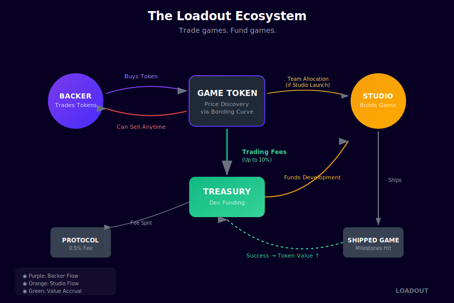

# Loadout

**Trade games. Fund games.**

Loadout is a platform where indie game developers launch tokens and raise capital through trading—not presales. Every trade generates fees that fund development directly, aligning traders and builders toward one goal: shipping great games.

<figure><figcaption>The Loadout Ecosystem</figcaption></figure>

## Why Loadout?

### For Backers
- **Early access** to promising games before they blow up
- **No VC advantages** — everyone enters on the same terms
- **Liquidity from day one** — buy and sell anytime
- **Your trades fund the game** — 9.5% of every trade goes to development

### For Studios
- **Funding without publishers** — keep control, keep your equity
- **No pitch process** — launch when you're ready
- **Capital scales with attention** — more hype = more funding
- **Built-in audience** — backers become your community

## How It Works

1. **Studio launches** a project with demo, docs, team info, and token
2. **Backers trade** the token — price moves with demand
3. **Trading fees** flow to the project treasury (9.5% per trade)
4. **Project graduates** when treasury hits 150 SOL
5. **Game ships** — token value reflects success

## Quick Links

- [What is Loadout?](guides/what-is-loadout.md)
- [How to Back a Project](traders/backing-projects.md)
- [Launch Your Game](developers/launch-guide.md)
- [Fee Structure](guides/fees.md)
- [Graduation](guides/graduation.md)

---

Built for game developers. Powered by degens.
