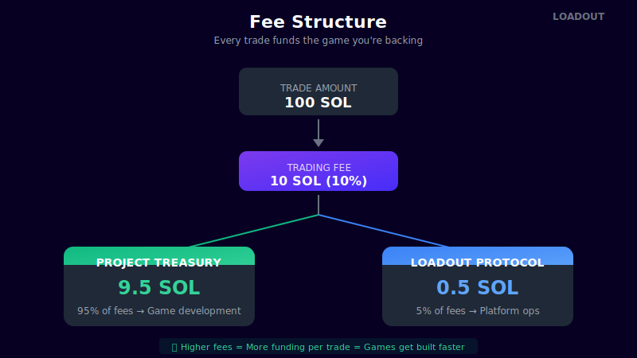

# Fee Structure

Loadout uses a 10% trading fee — higher than typical DEXs, but that's the point. This isn't a trading platform with funding attached. It's a **funding platform with trading attached**.

<figure><figcaption>How fees are distributed</figcaption></figure>

## The 10% Fee

Every buy and sell on Loadout incurs a 10% fee. This fee is split:

| Recipient | Share | Purpose |
|-----------|-------|---------|
| **Project Treasury** | 9.5% | Funds game development |
| **Loadout Protocol** | 0.5% | Platform operations |

### Example Trade

If you buy 100 SOL worth of a game token:
- **9.5 SOL** → Goes directly to the game's development treasury
- **0.5 SOL** → Goes to Loadout protocol
- **90 SOL** → Executes your trade on the bonding curve

## Why So High?

Traditional exchanges charge 0.1-0.3%. DEXs charge 0.3-1%. Why does Loadout charge 10%?

**Because the fee IS the product.**

On Loadout, you're not just trading — you're funding. Every trade contributes meaningfully to the game's development budget. A few thousand trades can fund months of development.

### The Math

| Daily Volume | Treasury Fees (9.5%) | Monthly Treasury |
|--------------|---------------------|------------------|
| $10,000 | $950/day | $28,500 |
| $50,000 | $4,750/day | $142,500 |
| $100,000 | $9,500/day | $285,000 |

For a hyped game doing decent volume, the treasury can accumulate serious funding purely from trading activity.

## Fee Comparison

| Platform | Fee | Where It Goes |
|----------|-----|---------------|
| Pump.fun | 1% | Platform only |
| Uniswap | 0.3% | LPs |
| Binance | 0.1% | Platform |
| **Loadout** | **10%** | **95% to game dev** |

## After Graduation

Once a project graduates and moves to a Meteora DLMM pool, trading continues on external AMMs. Loadout enforces fee policy at the token level using Token-2022 Transfer Hooks.

Post-graduation fee sharing continues to fund the project treasury, providing ongoing development capital beyond the initial bonding curve phase.

---

Next: [Graduation →](graduation.md)
