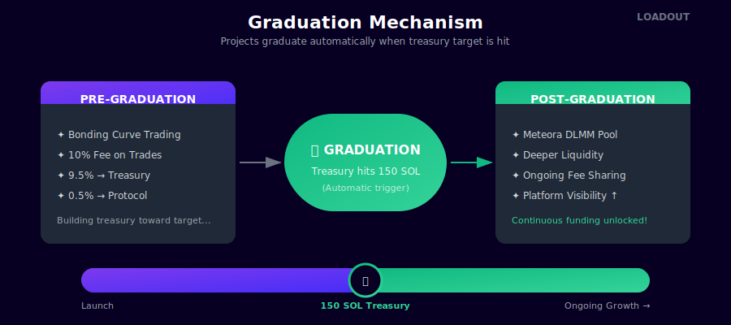

# Graduation

Graduation is the moment a project proves real demand and unlocks deeper liquidity. It happens automatically — no admin action required.

<figure><figcaption>The graduation mechanism</figcaption></figure>

## How Graduation Works

Projects graduate when their treasury hits **150 SOL** in accumulated trading fees.

That's it. One number. Universal. No tiers to game, no complicated thresholds. Just prove the market cares.

### Why 150 SOL?

We wanted something simple:

- **Achievable** — A reasonably hyped project can hit this in days
- **Meaningful** — ~$20K+ proves real trading interest, not just a few friends buying
- **Universal** — Same rules for everyone, no negotiating custom targets
- **Simple** — Easy to understand, easy to track progress

Pump.fun has their magic number. This is ours.

## What Changes at Graduation

### Before Graduation
- Trading on bonding curve
- 5% fee on all trades
- 4.75% flows to treasury, 0.25% to protocol
- Building toward the 150 SOL threshold

### After Graduation
- Meteora DLMM pool created automatically
- Deeper, more efficient liquidity
- Trading fees continue flowing to treasury
- Increased visibility on the platform
- LP position permanently locked (fees still claimable)

## The Graduation Trigger

Graduation is automatic and on-chain. When the treasury account hits 150 SOL:

1. Bonding curve trading completes
2. Meteora DLMM pool is created with 5% fee
3. Liquidity is seeded from the curve
4. LP position locked permanently
5. Trading resumes on the DLMM pool
6. Project marked as "Graduated" on platform

No human intervention. No delays. The market triggers it.

## Post-Graduation

Graduation isn't the finish line — it's the starting gate.

Post-graduation is where the real action happens. If your game has legs:

- **Trading volume increases** with deeper liquidity
- **Treasury keeps growing** from ongoing fees
- **Community compounds** as more people discover the project
- **Development accelerates** with real funding

The projects that graduate and keep shipping updates will generate far more treasury funding post-graduation than they did getting there.

## FAQ

**Why not let projects set their own graduation target?**

Because they'd game it. Set it low to graduate fast, and graduation becomes meaningless. One universal number keeps everyone honest.

**What if a project never graduates?**

Trading continues on the bonding curve. Treasury keeps accumulating. Some projects take longer — that's fine. The threshold isn't going anywhere.

**Can graduation be reversed?**

No. One-way door. Once graduated, always graduated.

**What happens to my tokens at graduation?**

Nothing changes for holders. Your tokens are the same. You just trade on the new Meteora pool instead of the bonding curve.

**Is 150 SOL set in stone?**

It's the launch parameter. Could be adjusted in the future based on data, but the principle of a single universal threshold stays.

---

Next: [Backing Projects →](../traders/backing-projects.md)
